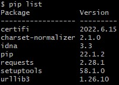
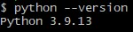
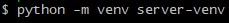
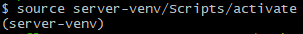
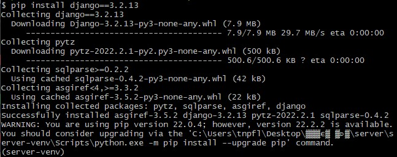
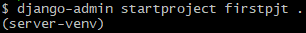
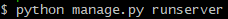
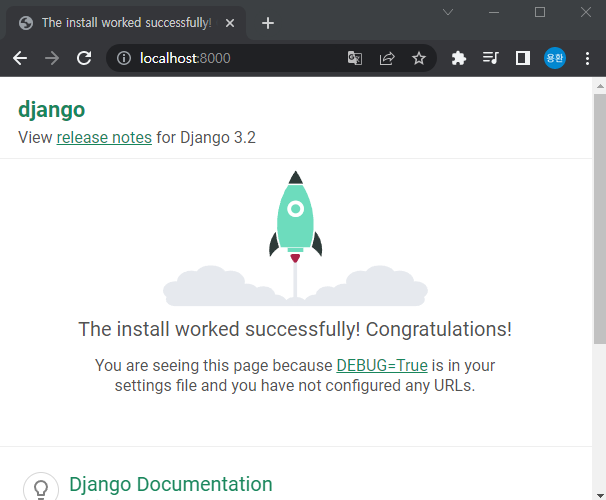

## django 설치 및 세팅

- 모든 것은 터미널에서 실행하여야 함. Git bash or VScode 터미널

- 기존에 깔려 있는 패키지 및 파이썬 version 확인 방법

  - pip list
  - python --verion

- 가상환경을 이용한 설치 방법

  - python -m venv [가상환경 이름]

  > python! server-venv 라는 이름으로 가상환경 '생성'해줘
  >
  > 현재 있는 폴더에서 하위 폴더로 server-venv 라는 폴더가 만들어진다.

  - source server-venv/Scripts/activate

  > 현재 폴더에서 server-venv 라는 하위 폴더가 만들어 졌기 때문에
  >
  > server-venv 폴더로 들어가서 Scripts 폴더로 들어가서 activate 를 실행해줘 라는 뜻이 됨.(Scripts  폴더에 들어가서  터미널을 실행하는 경우 source activate 만 치면 됨.)
  >
  > source 명령어는 파일이 새로 만들어지거나 변경 됐을때 파일 설정 적용하는 과정에서 리부팅없이 바로 적용하기 위해서 source 명령어를 사용한다고 인터넷에 나와있음.. 정확하진 않음 

  - 가상환경을 종료할 땐 deactivate 명령어를 치면 가상환경에서 빠져나오게 됨.
  - 가상환경에 접속하게 되면 (가상환경 이름) 라는 문구가 뜨게 되는데, 이 상태에서 원하는 pip 를 설치해주면 된다.

  > pip install 설치할 프로그램명==버전
  >
  > pip install django(프로그램명)==3.2.13(버전)
  >
  > 설치를 한 뒤에 pip list를 치면 잘 설치 됐는지 확인할 수 있다!

  - 프로젝트를 생성하는 방법

  > django-admin startproject  [프로젝트 이름] [시작 경로]
  >
  > '.' 은 현재 폴더 라는 뜻

  - 서버 실행 방법

  > 파이썬으로 manage.py 파일을 runserver 명령어로 실행하면 됨.
  >
  > 서버를 종료시키려면 Ctrl + c 를 누르면 서버가 닫힌다.
  
  - 잘 실행 됐는지 확인은 인터넷 창을 킨후 localhost:8000 을 적어보면 확인 할 수 있다.