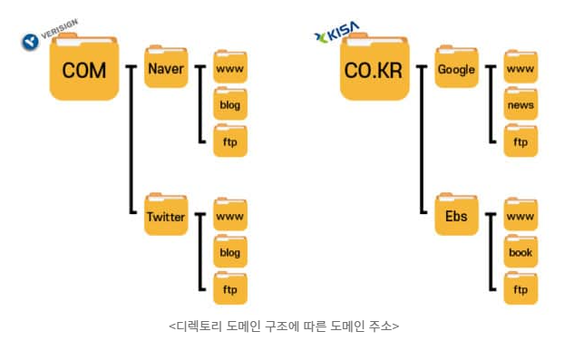

# 도메인(domain) 이란?

도메인은 쉽게 말해 가상공간에서 문패와 같은 역할을 하는 인터넷상의 주소입니다.

원래 숫자로 구성된 IP주소를 알기 쉽고 기억하기 쉽게 문자의 형태로 변환한 것입니다.

- 영문 도메인(63자 이하): 알파벳, 숫자, 하이픈(-)을 조합해서 사용

- 한글 도메인(17자 이하): 한글(완성형), 알파벳, 숫자, 하이픈(-)을 조합해서 사용

- IP(Internet Protocol) 주소: 인터넷에 연결되는 모든 기기의 위치와 식별을 위해 숫자(4개의 10진수)로 구성하여 부여된 고유주소

  > 예: 127.0.0.1

기본적으로 URL과 도메인은 혼용되어서 사용되기도 하지만 도메인 이름은 `https://www.` 를 제외한 나머지를 말합니다. 최상위 도메인(TLD)과 2차 도메인(SLD)영역으로 구성되어 있습니다. 

3차/4차 도메인 영역도 존재하지만 단순하게 콤마를 기준으로 어느 위치에 있는지를 나타내는 것일 뿐 특별한 의미는 없습니다.

TLD 란 영역 안에 SLD가 존재하고 종속 개념이 있는 이유는 TLD마다 관리하는 기관이 별도로 존재합니다.

도메인 체계는 국제적으로 **ICANN** 이라는 국제적 기관이 도메인과 관련된 모든 것을 통제하며, TLD를 만들어서 사업을 하고 싶어하는 조직/기관들에게 **도메인 등록기관(Registry OP)**이라는 명칭을 주고 해당 TLD 영역 하위에 있는 모든 도메인 주소들을 등록하고 관리할 수 있는 권한을 줍니다.

## 최상위 도메인 종류

최상위 도메인 종류도 형태에 따라 **국가 도메인(ccTLD**, Country-Code TLD)과 **일반 도메인(gTLD**, Generic TLD)으로 나뉨. 영어 약자가 더러워 보여서 그렇지 단순하게 국가 도메인은 국가의 특정 조직이 관리, 일반 도메인은 일반 회사가 관리하는 최상위 도메인입니다. 대표적인 **국가 도메인은 KISA가 관리하는 .kr 도메인**, **일반 도메인은 Verisign의 .com, .net, .org 도메인**이 있습니다.

#### **대표적인 일반 도메인 리스트(gTLD)**

- COM : 회사
- ORG : 공식적인 단체/기관
- NET : 단체/기관
- EDU : 교육
- GOV : 정부기관

#### **대표적인 국가 도메인 리스트(ccTLD)**

- KR : 한국 주소지
- CO.KR : 한국 주소지 상업적 목적
- OR.KR : 한국 주소지 비영리 목적
- GO.KR : 한국 주소지 정부기관
- AC.KR : 한국 주소지 대학기관

둘의 **차이는, 국가 도메인**은 일반 도메인과는 다르게 **웹사이트의 특징을 부가적으로 나타내는** 국가도메인의 **2차 도메인**(ccSLD, Country-Code SLD)이 ‘.CO/.OR’과 같이 앞에 붙는 경우가 있습니다. 하지만, 실생활에선 ccSLD와 같은 번잡스런 말은 사용하지 않고, TLD를 두 단계로 찢어서 표현한 형태로 보기 때문에, 도메인 구조에서 **.CO.KR과 같이 고정된 부분을 모두 일반적으로 TLD**라고 말합니다. 처음에 말한 2차 도메인은 위치를 나타낼 뿐 어떤 의미도 없다고 말한 것도 이런 맥락이라고 보면 됩니다.

## 루트도메인과 서브도메인

큼직한 웹사이트인 네이버는 블로그 **서비스에 대해서는 ‘blog.’**를, **뉴스 서비스에 대해서는 ‘news.’**를 서브도메인으로 사용. 또 다른 대표적인 예로는 블로그 서비스를 제공하는 **티스토리가 계정명으로 서브도메인**을 쪼개는 걸 볼 수 있습니다.

서브도메인이란 건 간단합니다. 위에서 말한 도메인 등록 기관(**Registry)에 등록되어 있는 하나의 루트 도메인**을 도메인 관리자의 목적에 맞게 **여러 개로 쪼개고 싶을 때 사용**. 물론 호스팅 업체에서 어디까지 자신이 엑세스할 수 있는지 확인해야지만 사용할 수 있습니다.