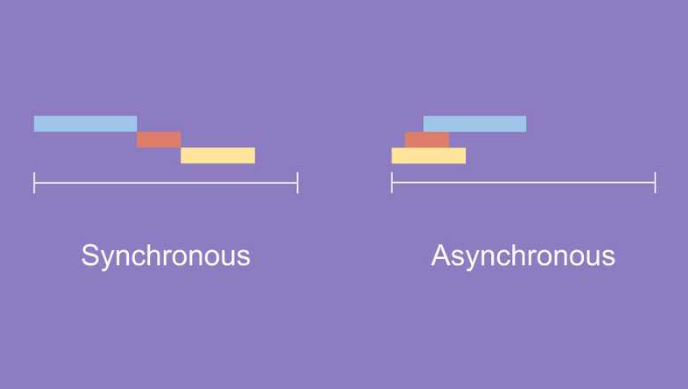
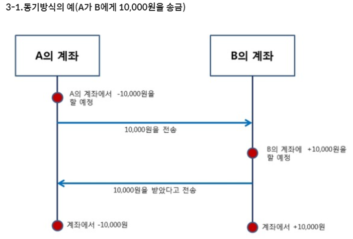
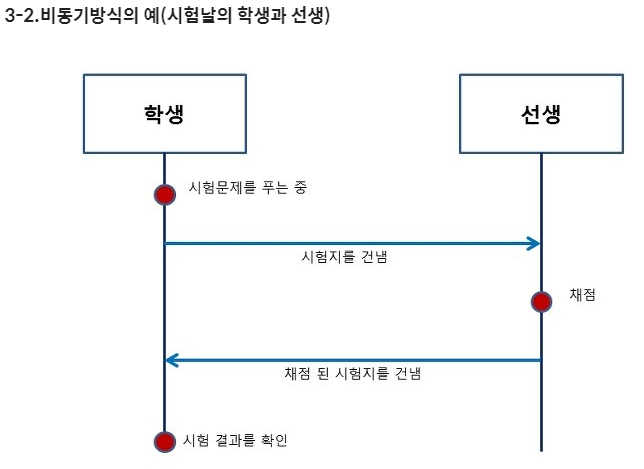

# 동기와 비동기의 차이

### 동기

- 보통 동기와 블로킹을 묶어서 얘기함

  > **블록( block )**
  >
  > 블록은 어떤 함수를 호출했을 때, 원하는 작업들을 모두 끝마칠 때까지 기다렸다가 return 되면 이것을 보고 블로킹되었다고 한다.
  
- 절차 지향과 비슷한 느낌

- 요청을 보낸 후 응답(=결과)를 받아야지만 다음 동작이 이루어지는 방식이다.

  어떠한 일을 처리할 동안 다른 프로그램은 정지한다.

  실제 cpu가 느려지는 것은 아니지만 시스템의 전체적인 효율이 저하된다고 할 수 있다.

- 웹 브라우저에서 서버에 요청을 보내고 응답을 받는다.

  이 때, 모든 정보를 받기 때문에 화면이 하얗게 되면서 응답이 끝날 때까지 다른 작업을 할 수 없게 된다.

### 비동기

- 보통 비동기와 논블로킹을 묶어서 얘기함

  > **논블록( non-block )**
  >
  > 논블록은 어떤 함수를 호출했을 때, 원하는 작업들을 요청하고 바로 return 되면 이것은 논블로킹되었다고 한다.
  
- JS 와 비슷한 느낌

- **Ajax**

  - 기존에는 Ajax는 Asynchronous Javascript and XML의 약자로 사용되었으나 이후에는 웹 어플리케이션 개발에 사용되는 기술 그룹을 말한다. 

    비동기 방식인 Ajax의 주목적으로는 화면 전환 없이 클라이언트와 서버간의 정보를 교환하기 위해서이다.

    기존 웹 어플리케이션에서는 HTTP 요청이 웹 서버로 전달되며, 웹 서버는 요청을 처리한 후 사용자에게 HTML 페이지를 리턴한다.

    이 과정에서 HTTP 전송 중에는 사용자는 웹 어플리케이션과 상호 작용을 할 수 없다.

    하지만 Ajax 통신을 이용하면 클라이언트와 화면을 랜더링하고 사용자와 서버간의 HTTP 전송과는 별도로 웹어플리케이션과 상호 작용을 할 수 있다. 

- 웹 브라우저로부터 일부의 정보를 요청하기 때문에 그 외에 부분은 다르지 않다.

  그렇기 때문에 화면이 하얗게 되는 것도 없고, 서버로 부터 응답이 끝나지 않더라도 다른 작업을 할 수 있다.

